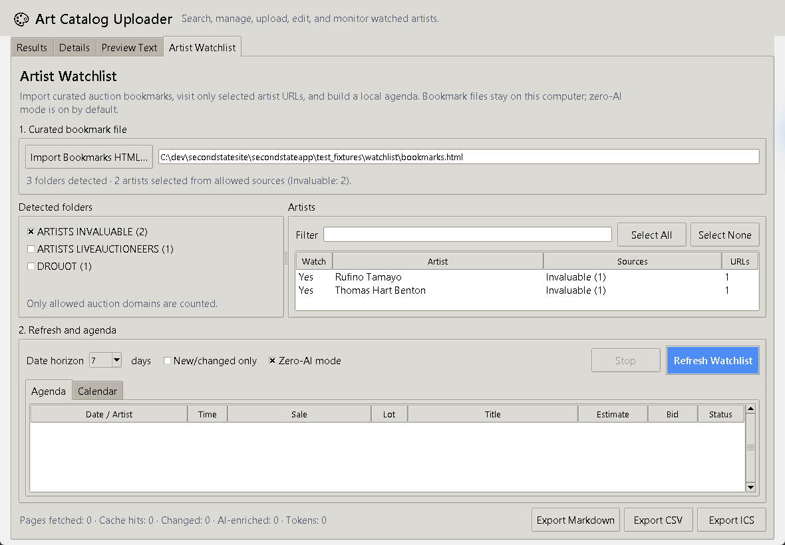
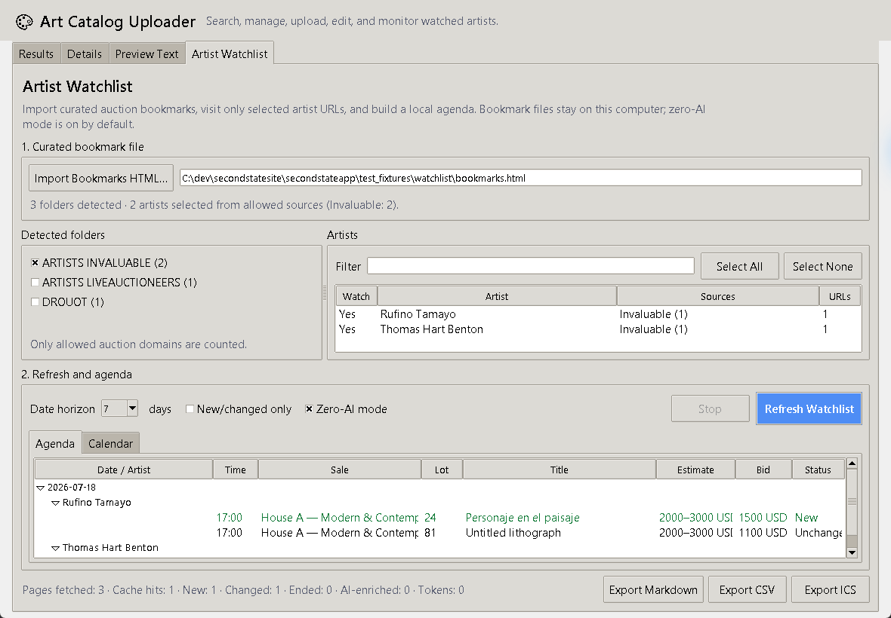

# Artist Watchlist

Issue #33 replaces broad Auction Search with a local, bookmark-driven agenda. The desktop app now visits only selected public auction URLs from an exported browser bookmark file. Invaluable is the first implemented source adapter; LiveAuctioneers and Drouot remain visible at import time but report that their adapters are not available yet.

## Screenshots

Bookmark import, safe folder selection, artist preview, and zero-AI default:



Synthetic agenda with efficiency metrics and export controls:



## Architecture

```text
local bookmark HTML
  -> selected folders + explicit domain allowlist
  -> batched Invaluable public catalog JSON adapter (HTML fallback for saved fixtures)
  -> normalized lot records
  -> local SQLite content-hash cache and diff
  -> optional compact ambiguous-record enrichment
  -> date/artist agenda + Markdown/CSV/ICS exports
  -> private website calendar sync + optional SMS reminder digests
```

The implementation is split by responsibility:

- `catalogapp/bookmark_watchlist.py`: Netscape bookmark parsing, nested URL decoding, folder/domain filtering, artist labels, and URL deduplication.
- `catalogapp/watchlist_adapters.py`: adapter interface plus deterministic Invaluable catalog-result, card, embedded JSON, detail, and pagination parsing. Invaluable's `/search` page is a JavaScript shell, so live refreshes use the same public `/catResults` JSON request as the page itself. Compatible selected artists are combined into an OR-facet request and split back into their individual bookmark memberships locally.
- `catalogapp/watchlist_fetch.py`: conservative HTTP retries/rate limiting and an explicit opt-in Playwright profile fallback.
- `catalogapp/watchlist_models.py`: stable normalized lot schema and local duplicate markers.
- `catalogapp/watchlist_cache.py`: SQLite lot, membership, source-run, and AI-enrichment caches.
- `catalogapp/watchlist_service.py`: incremental refresh, detail-fetch decisions, ended-item detection, horizons, and efficiency metrics.
- `catalogapp/watchlist_enrichment.py`: optional strict structured-output batching for ambiguous compact records.
- `catalogapp/watchlist_exports.py`: agenda Markdown, CSV, and RFC 5545 ICS generation.
- `catalogapp/watchlist_sync.py`: authenticated upload of normalized results to the staff-only website calendar.
- `catalogapp/watchlist_ui.py`: bookmark/folder/artist selection, refresh/stop controls, agenda/calendar views, and exports.

## Local data and privacy

- The bookmark file is read locally and is never copied into the repository or website database.
- The complete bookmark HTML and full scraped pages are never sent to OpenAI.
- Only entries in a user-selected folder and the explicit `invaluable.com`, `liveauctioneers.com`, or `drouot.com` allowlist are imported. Private Google Drive and unrelated URLs are rejected.
- Normal HTTP retrieval is the default. Invaluable catalog requests do not use browser cookies, a member token, or a logged-in profile. Optional Playwright use requires both `WATCHLIST_USE_PLAYWRIGHT=1` and a user-selected `WATCHLIST_PLAYWRIGHT_PROFILE` directory.
- The fetchers do not enter credentials, solve CAPTCHAs, bypass paywalls, or work around HTTP 401/403/429 controls.
- Local settings and cache data live under `%LOCALAPPDATA%\SecondState\ArtistWatchlist`, outside the repository.
- Zero-AI mode is enabled in the UI by default. Optional enrichment also requires `OPENAI_WATCHLIST_ENRICHMENT_ENABLED=1`.
- Enrichment sends only allowlisted normalized fields. URLs, bookmark data, page HTML, cookies, and credentials are excluded.
- Website calendar sync sends only normalized sale/lot fields. It excludes the bookmark file, page HTML, cookies, cache internals, images, and credentials.
- The Responses API request has no tools and uses a strict JSON schema. Ambiguous records are batched and cached by deterministic content hash.

Optional local environment settings:

```dotenv
OPENAI_WATCHLIST_ENRICHMENT_ENABLED=0
OPENAI_WATCHLIST_MODEL=gpt-5-mini
OPENAI_WATCHLIST_MAX_RECORDS_PER_BATCH=50
WATCHLIST_USE_PLAYWRIGHT=0
WATCHLIST_PLAYWRIGHT_PROFILE=
```

## Incremental behavior and metrics

Each lot is keyed by source plus source lot ID, falling back to its canonical URL. The cache stores a search-card hash and a normalized visible-content hash. An unchanged complete card is served from cache without fetching its detail page. New, changed, or still-incomplete cards may retrieve details. Successfully refreshed bookmark memberships that disappear are marked ended.

If a source is temporarily unavailable, the refresh keeps the last known active lots for that bookmark in the agenda and reports that cached data is being shown. It never marks lots ended from an incomplete or failed source refresh.

Every refresh reports:

- pages fetched;
- cache hits;
- new, changed, and ended lots;
- AI-enriched records;
- input, output, and total token usage.

## Calendar behavior

ICS output defaults to one event per auction sale. Matched artists and lots are grouped in the description. A timezone-aware source time is converted to UTC. A source date without a time becomes an all-day event and the description marks the time as unverified. Event-per-lot and reminders are supported by the export function but are intentionally not the noisy UI default.

The private web calendar at `/calendar/` is populated automatically after a successful refresh and can be retried with **Sync Website Calendar**. See [`auction-calendar.md`](auction-calendar.md) for authentication, deployment, and Twilio reminder setup.

## Migration note

Historical migration `0012_auctionsearchjob.py` is retained because it may already be applied. New migration `0013_delete_auctionsearchjob.py` safely removes that deployed model. The runtime model, imports, routes, views, polling helpers, environment constants, and broad-search tests are deleted.

## Manual verification

1. Run `python manage.py migrate` and confirm migration `0013_delete_auctionsearchjob` applies.
2. Start the catalog desktop app and confirm the notebook shows **Artist Watchlist**, with no **Auction Search** tab.
3. Export a small synthetic or test browser bookmark HTML file. Do not add a real bookmark export to Git.
4. Click **Import Bookmarks HTML…** and confirm `ARTISTS INVALUABLE` is selected by default.
5. Confirm private/unrelated domains do not appear and source/artist counts are shown before refresh.
6. Select a small artist subset, keep **Zero-AI mode** enabled, choose a horizon, and click **Refresh Watchlist**.
7. Confirm status reports pages, cache hits, changes, AI records, and tokens; use **Stop** during a refresh once.
8. Refresh the same fixture again and confirm unchanged complete lots produce cache hits and no repeated detail or AI request.
9. Inspect Agenda and Calendar views, then export Markdown, CSV, and ICS. Import the ICS into a temporary calendar and confirm one event per sale.
10. Verify upload, website listing edit/delete/reorder, gallery rendering, and artwork description generation still work.

## Automated verification

```powershell
.\.venv\Scripts\python.exe manage.py test
.\.venv\Scripts\python.exe -m compileall -q catalogapp secondstateapp
```

The synthetic tests cover bookmark safety, repeated decoding, adapters, pagination, retries, caching/diffs, duplicate marking, timezone/all-day ICS behavior, zero-AI mode, strict compact batching, enrichment caching, legacy removal, and preserved website regressions. No test contacts an auction site or OpenAI.

## Invaluable troubleshooting

A successful `GET /search` is not proof that auction data was returned: Invaluable currently responds with HTTP 200 and an empty JavaScript application shell. The live adapter therefore posts only the bookmarks' public artist/category/search filters to `/catResults`, combines compatible artist facets to reduce request volume, validates the JSON schema, and reports a source error if the endpoint returns HTML or an unexpected response. This prevents an empty shell from being recorded as a successful zero-result refresh. A temporary 401/403/429 is not bypassed; the agenda retains last-known cached lots and the user can retry later.
